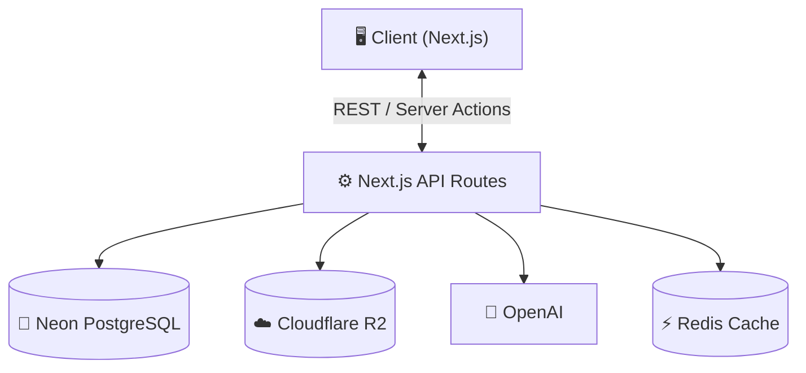
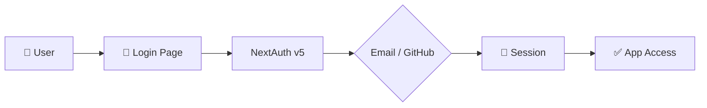
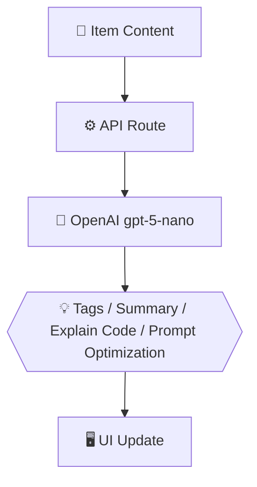
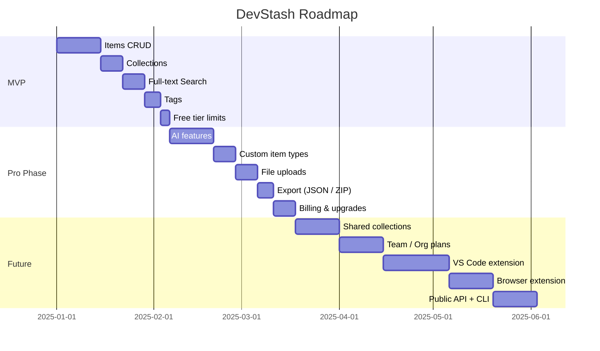

# 🗃️ DevStash — Project Overview

> **Centralized Developer Knowledge Hub** — Store smarter. Build faster.

---

## Table of Contents

1. [The Problem](#-the-problem)
2. [Target Users](#-target-users)
3. [Core Features](#-core-features)
4. [Item Types](#item-types)
5. [Data Model](#️-data-model)
6. [Tech Stack](#-tech-stack)
7. [Monetization](#-monetization)
8. [UI / UX](#-ui--ux)
9. [API Architecture](#-api-architecture)
10. [Auth Flow](#-auth-flow)
11. [AI Feature Flow](#-ai-feature-flow)
12. [Development Workflow](#️-development-workflow)
13. [Roadmap](#-roadmap)
14. [Status](#-status)

---

## 🧩 The Problem

Developers keep their essentials scattered across too many places:

| Where it lives | What's stored there |
| --- | --- |
| VS Code / Notion | Code snippets |
| Chat history | AI prompts |
| Buried project folders | Context files |
| Browser bookmarks | Useful links |
| Random folders | Docs |
| `.txt` files | Commands |
| GitHub Gists | Project templates |
| Bash history | Terminal commands |

This creates **context switching, lost knowledge, and inconsistent workflows**.

➡️ **DevStash provides one searchable, AI-enhanced hub for all developer knowledge and resources.**

---

## 🧑‍💻 Target Users

| Persona | Needs |
| --- | --- |
| 🧑‍💻 Everyday Developer | Quick access to snippets, commands, and links |
| 🤖 AI-First Developer | Store prompts, workflows, and context files |
| 🎓 Content Creator / Educator | Save course notes and reusable code |
| 🏗️ Full-Stack Builder | Patterns, boilerplates, and API references |

---

## ✨ Core Features

### A) Items & Item Types

Items are the core unit of DevStash. Each item belongs to a **system type** (available to all users) or a **custom type** (Pro only).

See [Item Types](#item-types) below for the full breakdown.

### B) Collections

Group items of any type into named collections. A single item belongs to one collection at a time.

**Examples:** `React Patterns`, `Context Files`, `Python Snippets`

> 💡 **Future consideration:** Promote to a many-to-many relationship (Item ↔ Collections) to allow items to live in multiple collections simultaneously.

### C) Search

Full-text search across:

- Title
- Content
- Tags
- Item type

### D) Authentication

- Email + Password
- GitHub OAuth

Powered by [NextAuth v5 (Auth.js)](https://authjs.dev).

### E) Additional Features

| Feature | Notes |
| --- | --- |
| ⭐ Favorites & pinned items | Quick-access priority items |
| 🕐 Recently used | Tracked via `lastUsedAt` on each item |
| 📥 Import from files | Drag-and-drop or file picker |
| ✍️ Markdown editor | For notes and text-based items |
| 📎 File uploads | Images, docs, templates via Cloudflare R2 |
| 📤 Export | JSON or ZIP archive |
| 🌙 Dark mode | Default theme |

### F) AI Superpowers

| Feature | Description |
| --- | --- |
| 🏷️ Auto-tagging | Suggest relevant tags on save |
| 📝 AI summary | One-line summary of any item |
| 🔍 Explain Code | Plain-English explanation of snippets |
| ✨ Prompt optimization | Rewrite and improve AI prompts |

> Powered by **OpenAI gpt-5-nano** — available on **Pro plan only**.

---

## Item Types

### System Types (all users)

| Icon | Type | Content | Example use |
| --- | --- | --- | --- |
| `</>` | **Snippet** | Code with syntax highlighting | Reusable functions, hooks |
| `💬` | **Prompt** | Plain text | GPT system prompts, LLM workflows |
| `📝` | **Note** | Markdown | Meeting notes, how-tos |
| `>_` | **Command** | Plain text / shell | `git`, `docker`, `npm` one-liners |
| `📄` | **File** | File upload | Templates, `.env` examples |
| `🖼️` | **Image** | Image upload | Screenshots, diagrams |
| `🔗` | **URL** | Link + optional description | Docs, articles, tools |

### Custom Types (Pro only)

Users can create their own types with a custom name, icon, and colour.

---

## 🗄️ Data Model

> This schema is a starting point and **will evolve**. Changes noted below the schema.

```prisma
// ─────────────────────────────────────────────
// NextAuth v5 required models
// ─────────────────────────────────────────────

model Account {
  id                String  @id @default(cuid())
  userId            String
  type              String
  provider          String
  providerAccountId String
  refresh_token     String? @db.Text
  access_token      String? @db.Text
  expires_at        Int?
  token_type        String?
  scope             String?
  id_token          String? @db.Text
  session_state     String?

  user User @relation(fields: [userId], references: [id], onDelete: Cascade)

  @@unique([provider, providerAccountId])
}

model Session {
  id           String   @id @default(cuid())
  sessionToken String   @unique
  userId       String
  expires      DateTime

  user User @relation(fields: [userId], references: [id], onDelete: Cascade)
}

model VerificationToken {
  identifier String
  token      String   @unique
  expires    DateTime

  @@unique([identifier, token])
}

// ─────────────────────────────────────────────
// App models
// ─────────────────────────────────────────────

model User {
  id                   String   @id @default(cuid())
  name                 String?  // required for NextAuth display name
  email                String   @unique
  emailVerified        DateTime? // required for NextAuth magic-link / email flow
  image                String?  // avatar from GitHub OAuth
  password             String?  // null for OAuth-only users
  isPro                Boolean  @default(false)
  stripeCustomerId     String?  @unique
  stripeSubscriptionId String?  @unique

  accounts    Account[]
  sessions    Session[]
  items       Item[]
  itemTypes   ItemType[]
  collections Collection[]
  tags        Tag[]

  createdAt DateTime @default(now())
  updatedAt DateTime @updatedAt
}

model Item {
  id          String   @id @default(cuid())
  title       String
  contentType String   // "text" | "file"
  content     String?  @db.Text  // for text-based types
  fileUrl     String?
  fileName    String?
  fileSize    Int?
  url         String?
  description String?
  isFavorite  Boolean  @default(false)
  isPinned    Boolean  @default(false)
  language    String?  // e.g. "typescript", "python" — for syntax highlighting
  lastUsedAt  DateTime? // updated on each view/copy — powers "Recently Used"

  userId       String
  user         User        @relation(fields: [userId], references: [id], onDelete: Cascade)

  typeId       String
  type         ItemType    @relation(fields: [typeId], references: [id])

  collectionId String?
  collection   Collection? @relation(fields: [collectionId], references: [id])

  tags         ItemTag[]

  createdAt DateTime @default(now())
  updatedAt DateTime @updatedAt

  @@index([userId])
  @@index([collectionId])
  @@index([typeId])
}

model ItemType {
  id       String  @id @default(cuid())
  name     String
  icon     String?
  color    String?
  isSystem Boolean @default(false) // true = built-in, false = user-created (Pro)

  userId String?
  user   User?   @relation(fields: [userId], references: [id], onDelete: Cascade)

  items  Item[]

  @@unique([name, userId]) // prevent duplicate custom type names per user
}

model Collection {
  id          String  @id @default(cuid())
  name        String
  description String?
  isFavorite  Boolean @default(false)

  userId String
  user   User   @relation(fields: [userId], references: [id], onDelete: Cascade)

  items Item[]

  createdAt DateTime @default(now())
  updatedAt DateTime @updatedAt

  @@index([userId])
}

model Tag {
  id     String @id @default(cuid())
  name   String

  userId String
  user   User   @relation(fields: [userId], references: [id], onDelete: Cascade)

  items ItemTag[]

  @@unique([name, userId]) // prevent duplicate tag names per user
}

model ItemTag {
  itemId String
  tagId  String

  item Item @relation(fields: [itemId], references: [id], onDelete: Cascade)
  tag  Tag  @relation(fields: [tagId], references: [id], onDelete: Cascade)

  @@id([itemId, tagId])
}
```

### Schema change notes

- **`Account`, `Session`, `VerificationToken`** — required by the [NextAuth v5 Prisma Adapter](https://authjs.dev/getting-started/adapters/prisma). Without these, OAuth and session handling will not work.
- **`User.name`, `User.image`, `User.emailVerified`** — required fields for NextAuth to populate from OAuth providers.
- **`Item.lastUsedAt`** — update this on every item open/copy event to power the "Recently Used" view.
- **`Item.content @db.Text`** — use `@db.Text` in Postgres to avoid the 191-character default limit on `String` fields.
- **`onDelete: Cascade`** — added throughout so deleting a user cleans up all their data.
- **`@@unique([name, userId])`** — added to `Tag` and `ItemType` to prevent duplicate names per user at the database level.
- **`@@index`** — added on common query patterns (`userId`, `collectionId`, `typeId`).

---

## 🧱 Tech Stack

| Category | Choice | Docs |
| --- | --- | --- |
| Framework | **Next.js 15 (React 19)** | [nextjs.org](https://nextjs.org) |
| Language | TypeScript | [typescriptlang.org](https://www.typescriptlang.org) |
| Database | Neon PostgreSQL | [neon.tech](https://neon.tech) |
| ORM | Prisma | [prisma.io](https://www.prisma.io) |
| Caching | Redis *(optional)* | [upstash.com](https://upstash.com) *(recommended with Vercel)* |
| File Storage | Cloudflare R2 | [developers.cloudflare.com/r2](https://developers.cloudflare.com/r2) |
| CSS | Tailwind CSS v4 | [tailwindcss.com](https://tailwindcss.com) |
| UI Components | shadcn/ui | [ui.shadcn.com](https://ui.shadcn.com) |
| Auth | NextAuth v5 (Auth.js) | [authjs.dev](https://authjs.dev) |
| AI | OpenAI gpt-5-nano | [platform.openai.com](https://platform.openai.com) |
| Payments | Stripe | [stripe.com](https://stripe.com/docs) |
| Deployment | Vercel | [vercel.com](https://vercel.com) |
| Monitoring | Sentry *(later)* | [sentry.io](https://sentry.io) |

---

## 💰 Monetization

| Plan | Price | Item Limit | Collections | Features |
| --- | --- | --- | --- | --- |
| 🆓 Free | $0 / month | 50 items | 3 collections | Basic search, image uploads — no AI |
| ⭐ Pro | $8 / month or $72 / year | Unlimited | Unlimited | File uploads, custom types, all AI features, export |

Payments and subscription lifecycle handled by **[Stripe](https://stripe.com/docs)** with webhooks to sync `isPro`, `stripeCustomerId`, and `stripeSubscriptionId` on the `User` model.

---

## 🎨 UI / UX

**Design philosophy:** Dark-first, minimal, developer-friendly — inspired by [Notion](https://notion.so), [Linear](https://linear.app), and [Raycast](https://www.raycast.com).

| Feature | Detail |
| --- | --- |
| 🌙 Dark mode | Default theme |
| `</>` Syntax highlighting | Applied to Snippet and Command types |
| 📐 Layout | Collapsible sidebar + main grid/list workspace + full-screen item editor |
| 📱 Responsive | Mobile drawer for sidebar, touch-optimised icons and buttons |

### Screenshots

Refer to the screenshots below as a base for the dashboard. it does not have to be exact. Use it as a reference:
- @context/screenshots/dashboard-ui-main.png
- @context/screenshots/dashboard-ui-drawer.png

---

## 🔌 API Architecture



---

## 🔐 Auth Flow



---

## 🧠 AI Feature Flow



---

## 🗂️ Development Workflow

This project is built as a course — one branch per lesson so students can follow along and compare their work.

```bash
git switch -c lesson-01-setup
git switch -c lesson-02-auth
git switch -c lesson-03-items-crud
# ...and so on
```

**Tools in use:**

- [Cursor](https://www.cursor.com) / [Claude](https://claude.ai) / [ChatGPT](https://chatgpt.com) for AI assistance
- [Sentry](https://sentry.io) for runtime monitoring and error tracking
- GitHub Actions *(optional)* for CI

---

## 🧭 Roadmap



### Feature breakdown

**MVP**
- Items CRUD (create, read, update, delete)
- Collections
- Full-text search
- Basic tagging
- Free tier limits enforced

**Pro Phase**
- All AI features (auto-tag, summarise, explain, optimise)
- Custom item types
- File uploads via Cloudflare R2
- Export to JSON / ZIP
- Billing & upgrade flow via Stripe

**Future Enhancements**
- Shared collections (read-only links)
- Team / Org plans
- VS Code extension
- Browser extension
- Public REST API + CLI tool

---

## 📌 Status

**Current phase:** Planning complete — ready for environment setup and UI scaffolding.

| Milestone | Status |
| --- | --- |
| Project spec & data model | ✅ Done |
| Environment setup | ⬜ Next |
| Auth (NextAuth v5) | ⬜ Pending |
| Items CRUD | ⬜ Pending |
| Collections & tags | ⬜ Pending |
| Search | ⬜ Pending |
| Stripe billing | ⬜ Pending |
| AI features | ⬜ Pending |
| Deployment | ⬜ Pending |

---

> 🏗️ **DevStash — Store Smarter. Build Faster.**